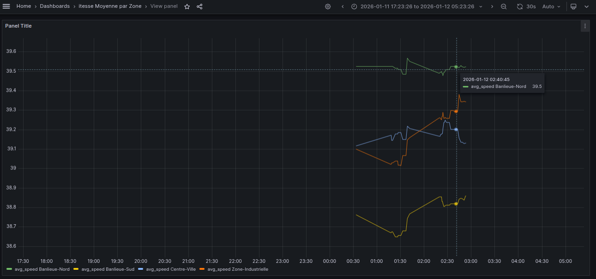

# Smart City Traffic Analytics Platform

A real-time data engineering platform for analyzing urban traffic patterns using Apache Kafka, HDFS, Apache Spark, and Apache Airflow.

## Table of Contents

- Overview
- Architecture
- Features
- Prerequisites
- Installation
- Usage
- Project Structure
- Services & Access URLs
- Data Flow
- Configuration
- Monitoring
- Troubleshooting
- Development

## Overview

This platform simulates and processes smart city traffic data in real-time. It demonstrates a complete modern data engineering pipeline that:

- **Generates** synthetic traffic events from virtual sensors
- **Ingests** streaming data via Apache Kafka
- **Stores** raw data in HDFS (Hadoop Distributed File System)
- **Processes** data using Apache Spark
- **Orchestrates** workflows with Apache Airflow
- **Visualizes** analytics through Grafana dashboards

## Architecture

```
Traffic Generator → Kafka → Airflow → HDFS → Spark → PostgreSQL → Grafana
                                ↓
                            (Orchestration)
```

### Components

- **Kafka**: Message broker for streaming traffic events
- **Zookeeper**: Kafka coordination service
- **HDFS**: Distributed storage for raw event data
- **Spark**: Distributed data processing engine
- **Airflow**: Workflow orchestration and scheduling
- **PostgreSQL**: Metadata store (Airflow) and analytics database
- **Grafana**: Visualization and monitoring
- **PgAdmin**: PostgreSQL database management

## Features

- **Real-time Traffic Simulation**: Generates realistic traffic patterns with multiple sensors and zones
- **Scalable Data Ingestion**: Kafka-based streaming with configurable batch processing
- **Distributed Storage**: HDFS for reliable data lake storage
- **Automated Processing**: Airflow DAGs for scheduled data pipelines
- **Analytics Computation**: Spark jobs calculate traffic statistics by zone
- **Visual Monitoring**: Grafana dashboards for real-time insights

## Prerequisites

- **Docker** (v20.10+)
- **Docker Compose** (v2.0+)
- **Python** (3.8+) - for running the traffic generator locally
- **Minimum Resources**:
  - 4 GB RAM
  - 2 CPU cores
  - 10 GB disk space

## Installation

### 1. Clone the Repository

```bash
git clone https://github.com/AzmiZakaria/project_traffic_urbain.git
cd data_prject
```

### 2. Set Up Python Virtual Environment

```bash
# Create virtual environment
python3 -m venv venv

# Activate virtual environment
# On Linux/MacOS:
source venv/bin/activate
# On Windows:
# venv\Scripts\activate
```

### 3. Install Python Dependencies (for traffic generator)

```bash
pip install -r requirements.txt
```

### 4. Initialize the Platform

```bash
chmod +x scripts/start.sh
./scripts/start.sh
```

This script will:
- Create necessary directories
- Generate the .env file with proper configuration
- Initialize Airflow database
- Start all Docker services
- Display access URLs

### 5. Verify Services

```bash
chmod +x scripts/check-services.sh
./scripts/check-services.sh
```

**Note**: Remember to activate the virtual environment (`source venv/bin/activate`) whenever you want to run the traffic generator or work with Python dependencies.


## Usage

### Starting the Platform

```bash
# Start databases first
docker-compose up -d postgres zookeeper

# Wait 20 seconds, then start everything
docker-compose up -d
```

### Generating Traffic Data

Run the traffic generator to start producing events:

```bash
python traffic_generator.py
```

You should see output like:


### Running the Pipeline

The Airflow DAG `traffic_ingestion_kafka_hdfs` runs automatically every minute and:

1. **Consumes** messages from Kafka topic `traffic-events`
2. **Writes** batches to HDFS as JSON files
3. **Triggers** Spark job to process data
4. **Saves** analytics to PostgreSQL

### Viewing Results

- **Airflow UI**: Monitor DAG execution at http://localhost:8080
- **HDFS Web UI**: Check stored files at http://localhost:9870
- **Spark UI**: View job status at http://localhost:8081
- **Grafana**: Create dashboards at http://localhost:3000

## Project Structure

```
.
├── dags/
│   └── kafka_to_hdfs_dag.py          # Airflow DAG definition
├── jobs/
│   └── process_traffic.py            # Spark processing job
├── scripts/
│   ├── start.sh                      # Platform initialization
│   ├── check-services.sh             # Health check script
│   └── init-databases.sh             # PostgreSQL setup
├── config/                           # Service configurations
├── data/                             # Persistent data (gitignored)
├── logs/                             # Airflow logs (gitignored)
├── docker-compose.yml                # Service orchestration
├── traffic_generator.py              # Event simulator
├── requirements.txt                  # Python dependencies
└── .env                              # Environment variables
```

## Services & Access URLs

| Service | URL | Credentials |
|---------|-----|-------------|
| **Airflow** | http://localhost:8080 | `airflow` / `airflow` |
| **Spark Master** | http://localhost:8081 | - |
| **Spark Worker** | http://localhost:8082 | - |
| **HDFS NameNode** | http://localhost:9870 | - |
| **Grafana** | http://localhost:3000 | `admin` / `admin` |
| **PgAdmin** | http://localhost:5050 | `admin@admin.com` / `admin` |
| **PostgreSQL** | localhost:5432 | `airflow` / `airflow` |
| **Kafka** | localhost:9093 (external) | - |

## Data Flow

### 1. Data Generation
traffic_generator.py produces events with schema:
```json
{
  "event_id": "uuid",
  "sensor_id": "sens-X",
  "road_id": "rd-X",
  "road_type": "Autoroute|Boulevard|Rue|Avenue",
  "zone": "Centre-Ville|Zone-Industrielle|...",
  "vehicle_count": 0-150,
  "average_speed": 5-90,
  "occupancy_rate": 0-100,
  "timestamp": "ISO-8601"
}
```

### 2. Ingestion (Kafka → HDFS)
The `consume_and_store_hdfs` function:
- Reads batches of up to 1000 messages
- Converts to NDJSON format
- Writes to HDFS path: `/data/raw/traffic/traffic_YYYYMMDD_HHMMSS.json`

### 3. Processing (Spark)
process_traffic.py computes:
- Average speed per zone
- Average occupancy rate per zone
- Total events per zone

Outputs:
- **Parquet files** → `hdfs://namenode:9000/data/analytics/traffic_stats`
- **PostgreSQL table** → `traffic_analytics`

### 4. Visualization
Connect Grafana to PostgreSQL data source to query the `traffic_analytics` table.

## Configuration

### Environment Variables

Key variables in .env:

```bash
AIRFLOW_UID=1000                                    # Host user ID
AIRFLOW_IMAGE_NAME=apache/airflow:2.9.3
_AIRFLOW_WWW_USER_USERNAME=airflow
_AIRFLOW_WWW_USER_PASSWORD=airflow
_PIP_ADDITIONAL_REQUIREMENTS=kafka-python hdfs
```

### Kafka Configuration

- **Internal network**: `kafka:9092` (used by services)
- **External access**: `localhost:9093` (used by traffic_generator.py)

### HDFS Configuration

- **NameNode**: `hdfs://namenode:9000`
- **Data directories**:
  - Raw data: `/data/raw/traffic/`
  - Analytics: `/data/analytics/traffic_stats/`

### Spark Configuration

Edit docker-compose.yml to adjust resources:
```yaml
spark-worker:
  environment:
    - SPARK_WORKER_CORES=2
    - SPARK_WORKER_MEMORY=2g
```

## Monitoring

### Health Checks

Run the automated health check:
```bash
./scripts/check-services.sh
```

### Manual Checks

**Check Kafka topics:**
```bash
docker exec kafka kafka-topics --list --bootstrap-server localhost:9092
```

**Check HDFS files:**
```bash
docker exec namenode hdfs dfs -ls /data/raw/traffic
```

**View Airflow logs:**
```bash
docker-compose logs -f airflow-scheduler
```

**Check Spark job logs:**
```bash
docker-compose logs -f spark-master
```

## Troubleshooting

### Issue: Airflow DAG not running

**Solution:**
1. Check scheduler logs: `docker-compose logs airflow-scheduler`
2. Verify DAG is visible in UI at http://localhost:8080
3. Ensure DAG is unpaused (toggle switch in UI)

Issue: Permission Denied for Docker Socket
### Issue: Permission Denied for Docker Socket
If Airflow cannot trigger the Spark job via docker exec
**Solution:**
run: `sudo chmod 666 /var/run/docker.sock`


### Issue: Kafka connection refused

**Solution:**
1. Verify Kafka is running: `docker-compose ps kafka`
2. Check if port 9093 is exposed: `docker-compose port kafka 9093`
3. Ensure traffic_generator.py uses `localhost:9093`

### Issue: HDFS files not created

**Solution:**
1. Check HDFS health: `docker exec namenode hdfs dfsadmin -report`
2. Verify directory exists: `docker exec namenode hdfs dfs -mkdir -p /data/raw/traffic`
3. Check Airflow task logs in UI

### Issue: Spark job fails with JDBC error

**Solution:**
1. Ensure PostgreSQL JDBC driver is in Spark classpath
2. Download driver to jobs directory:
```bash
wget https://jdbc.postgresql.org/download/postgresql-42.7.3.jar -P jobs/
```
3. Update kafka_to_hdfs_dag.py `--jars` path

### Resetting the Platform

```bash
docker-compose down -v
rm -rf data/ logs/
./scripts/start.sh
```

## Development

### Adding New DAGs

1. Create DAG file in dags directory
2. Wait for Airflow to detect it (check logs)
3. Refresh Airflow UI

### Modifying Spark Jobs

1. Edit process_traffic.py
2. Restart the Spark job via Airflow or manually:
```bash
docker exec spark-master /opt/spark/bin/spark-submit \
  --master spark://spark-master:7077 \
  --jars /opt/jobs/postgresql-42.7.3.jar \
  /opt/jobs/process_traffic.py
```

### Testing Changes

```bash
# Run tests
pytest tests/

# Check code coverage
pytest --cov=.
```

## Stopping the Platform

```bash
# Stop all services
docker-compose down

# Stop and remove volumes (WARNING: deletes all data)
docker-compose down -v
```

## Useful Commands

```bash
# View all service logs
docker-compose logs -f

# View specific service logs
docker-compose logs -f kafka

# Restart a service
docker-compose restart airflow-scheduler

# Enter a container shell
docker exec -it spark-master bash

# Check Docker resource usage
docker stats

# List all volumes
docker volume ls
```